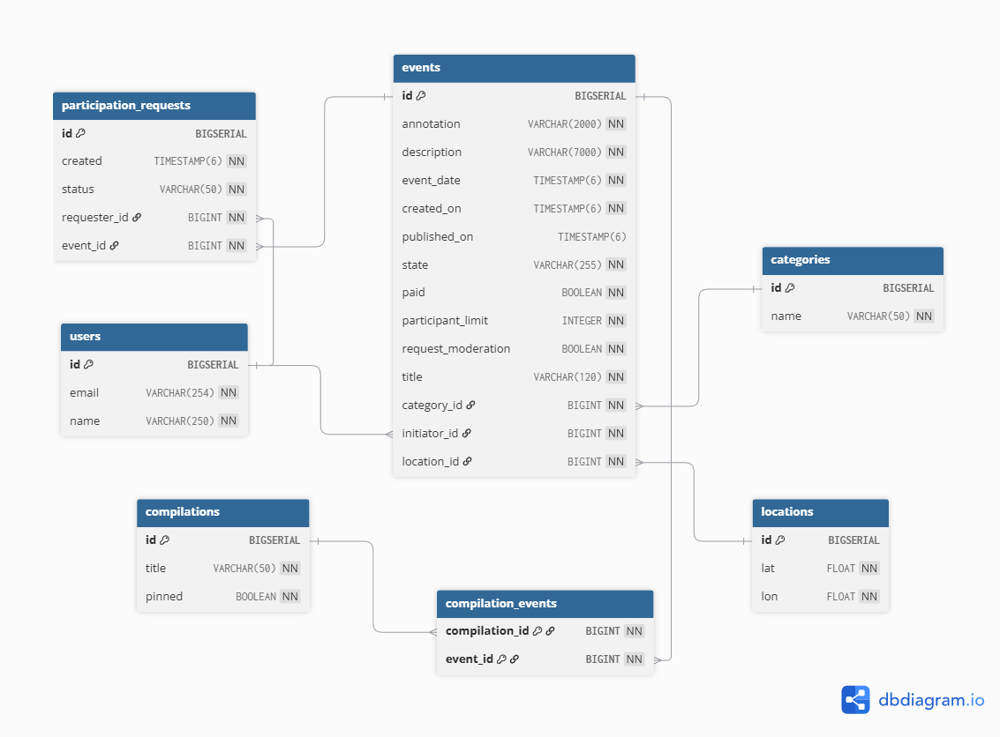

# Explore With Me — Main, Stats & Comments Feature

## Waiting Pull Request
https://github.com/imposmas/java-explore-with-me/pull/3 

---
## Overview
Explore With Me is a multi-module application consisting of:
- **ewm-main-service** — manages events, categories, users, compilations, participation requests, and comments.
- **ewm-stats-service** — collects and provides view statistics for events.

Each service runs independently and uses its own PostgreSQL database.

---

# 📦 Modules

## 1. ewm-main-service
Handles:
- Public event search  
- User event management  
- Participation request workflow  
- Admin event moderation  
- Categories  
- Compilations  
- **Comments (new feature)**  

## 2. ewm-stats-service
Handles:
- Saving endpoint hits  
- Aggregating view statistics  
- Querying view counts for events  

---

# 📄 Swagger Documentation

### Main Service Swagger
[ewm-main-service-spec.json](./ewm-main-service-spec.json)

### Stats Service Swagger
[ewm-stat-service-spec.json](./ewm-stat-service-spec.json)

---

# 🧪 Postman Test Collection

### Main Service
[ewm-main-service.json](./postman/ewm-main-service.json)

### Stats Service
[ewm-stat-service.json](./postman/ewm-stat-service.json)

### Feature Comments
[feature.json](./postman/feature.json)

---

# 🗄 Database Schema

## Main Service DB (`ewm`)
Tables:
- users  
- categories  
- locations  
- events  
- compilations  
- compilation_events  
- participation_requests  
- **comments** (new table)



## Stats Service DB (`stats`)
Tables:
- endpoint_hits  
- stats_view  

---

# ▶ Running with Docker Compose

Start all modules:

```bash
docker-compose up --build
```

Services:
- Main service → http://localhost:8080  
- Stats service → http://localhost:9090  
- Postgres main → localhost:6542  
- Postgres stats → localhost:6541  

---

# 📁 Repository Structure

```
ewm-main-service/
ewm-stats/
docker-compose.yml
README.md
```

---

# ⚙ Technologies
- Java 21  
- Spring Boot 3  
- Hibernate/JPA  
- PostgreSQL 15  
- Docker & Docker Compose  
- Lombok  
- RestTemplate for interservice communication  
- Maven multi‑module project  

---

# 💬 COMMENTS FEATURE DOCUMENTATION

The Comments module provides:
- Public read-only comment access  
- Users can create/update/delete own comments  
- Admins can view and delete any comment  

Comments may be added **only to PUBLISHED events**, and users cannot comment on their own events.

---

# 📌 Business Requirements

### General Rules
1. Only registered users may create/modify/delete comments.  
2. Public access must not expose author details.  
3. Comments allowed only for **PUBLISHED** events.  
4. User cannot comment their own event.  
5. Only author or admin can edit/delete a comment.  
6. Comments of canceled/rejected events must not be shown.  
7. Default date range → last 10 days.  
8. Pagination uses Practicum standard (`from`, `size`).  

---

# 🧱 Data Model

## Comment Entity

| Field       | Type              | Description |
|-------------|-------------------|-------------|
| id          | Long              | Comment ID |
| text        | String (≤2000)    | Comment body |
| author      | User              | Comment author |
| eventId     | Long              | Target event |
| createdOn   | LocalDateTime     | Timestamp |

---

# 📦 DTOs

## PublicCommentDto

```json
{
  "id": 15,
  "eventId": 12,
  "text": "Great event!",
  "createdOn": "2025-12-05 15:50:01"
}
```

## PrivateCommentDto

```json
{
  "id": 15,
  "eventId": 12,
  "text": "Great event!",
  "author": { "id": 5, "name": "John Doe" },
  "createdOn": "2025-12-05 15:50:01"
}
```

## CommentDto

```json
{
  "text": "Updated comment text"
}
```

---

# 🌐 API Endpoints

---

# 📖 PUBLIC API

## **GET /comments**

Retrieve event comments publicly (author hidden).

### Query Params

| Name        | Required | Description |
|-------------|----------|-------------|
| eventId     | yes | Event ID |
| rangeStart  | no | Start timestamp |
| rangeEnd    | no | End timestamp |
| from        | no | Default 0 |
| size        | no | Default 10 |

### Response 200

```json
[
  {
    "id": 10,
    "eventId": 20,
    "text": "Nice!",
    "createdOn": "2025-12-01 11:22:55"
  }
]
```

---

# 🔐 USER (PRIVATE) API

Base: `/users/{userId}/comments`

---

## POST /users/{userId}/comments?eventId=...

Create a new comment.

### Request:

```json
{
  "text": "My comment"
}
```

### Success 201:

```json
{
  "id": 55,
  "eventId": 10,
  "text": "My comment",
  "author": { "id": 7, "name": "Alice" },
  "createdOn": "2025-12-05 14:00:01"
}
```

---

## GET /users/{userId}/comments?eventId=...

Returns comments with author details.

---

## GET /users/{userId}/comments/{commentId}

Return a single comment with author.

---

## PATCH /users/{userId}/comments/{commentId}

Update own comment.

---

## DELETE /users/{userId}/comments/{commentId}

Delete own comment.

---

# 🛡 ADMIN API

Base: `/admin/comments`

---

## GET /admin/comments/by-event?eventId=...

Return comments for event with authors.

---

## GET /admin/comments/by-user?userId=...

Return all comments created by user.

---

## DELETE /admin/comments/{commentId}

Delete any comment.

---

# ⚠ Error Format (ApiError)

```json
{
  "status": "BAD_REQUEST",
  "reason": "Incorrectly made request.",
  "message": "rangeEnd cannot be before rangeStart",
  "timestamp": "2025-12-05 21:20:05"
}
```

---

# 🧪 Validation

- Text required  
- Cannot be blank  
- Max length 2000 chars  

---

# 📅 Date Range Rules

Defaults:
- rangeStart = now - 10 days  
- rangeEnd = now  

Validation:
```
rangeEnd >= rangeStart
```

---

# 📘 Pagination

```
page = from / size
sorted by createdOn DESC
```

---

# ✅ End of README
